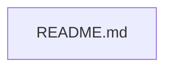

# Repository

*This README is automatically generated and maintained.*

## Overview

This repository appears to be an automated self-documenting system.

## Key Features

- Automated architecture discovery

- Continuous documentation generation

- Interactive dependency diagrams

- AI-powered repository summaries

- CI/CD integrations for tests and security

## Technology Stack

- **Markdown**: 1 files

## System Architecture

The architecture consists of a set of Python scripts that analyze the codebase, generate dependency graphs, and automatically construct a cohesive documentation package including architecture diagrams and an updated README.

### Components

Key components include scripts for analysis, diagram generation, AI summarization, and README compilation.

## Interactive Architecture Diagrams

# Repository Architecture

This diagram was automatically generated based on the codebase structure.

## Repository Stats

- **Total Files Analyzed**: 1

- **Total Lines of Code**: 91

## Setup Instructions

1. Clone the repository

2. Install dependencies (e.g., `pip install -r scripts/requirements.txt`)

3. Run the automation scripts locally if desired.

## Deployment Instructions

This repository relies heavily on GitHub Actions. Ensure Actions are enabled in your repository settings.

## Environment Variables

- `OPENAI_API_KEY`: Required for the AI Documentation Agent to summarize changes.

## API Documentation

No external APIs are currently exposed.

## Contribution Guide

Please submit Pull Requests. The CI pipeline will automatically run linting, tests, security scans, and update the architecture diagrams and documentation upon merge.

## Recent Changes

The system was recently initialized with its core automation scripts.

---
*Last updated: 2026-06-15 05:12:30*